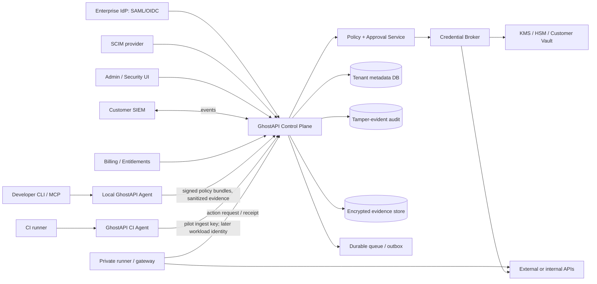

# GhostAPI: enterprise-дорожная карта продукта

**Статус документа:** целевая продуктовая и инженерная спецификация, а не обещание сроков или заявление о доступности функций.
**Дата среза текущего состояния:** 22 августа 2026 года.
**Аудитория:** основатели, product/engineering/security, design partners, enterprise-покупатели, юридическая команда и инвесторы.

## 1. Коротко: каким должен стать GhostAPI

GhostAPI сегодня — локальная среда для безопасной разработки и проверки интеграций AI-агентов. Целевой enterprise-продукт переносит эту ценность на уровень команды и компании:

- разработчик по-прежнему быстро запускает GhostAPI локально;
- агент не получает прямой доступ к производственным секретам и внешним API без политики и разрешения;
- команда централизованно управляет организациями, проектами, окружениями, политиками и сценариями;
- служба безопасности видит проверяемый аудит, экспортирует события в SIEM и может немедленно остановить опасные действия;
- руководитель получает понятные данные о риске, надежности, использовании и стоимости;
- крупный клиент может выбрать SaaS, выделенный single-tenant или on-premises-вариант;
- все коммерческие и compliance-заявления подтверждаются работающими контролями, тестами и независимыми доказательствами.

Целевой результат можно сформулировать просто:

> GhostAPI становится безопасным слоем между AI-агентами, кодом компании и внешними API: он сначала моделирует, затем проверяет, запрашивает нужные разрешения и только после этого допускает строго ограниченное действие.

## 2. Как читать приоритеты

В документе используются три метки.

| Метка | Значение | Правило выпуска |
| --- | --- | --- |
| **P0: до первого платного enterprise-пилота** | Минимум для одного hosted CI workflow: прием только ограниченного sanitized evidence, просмотр результатов и принятие merge/release-решения без внешних production-действий. | Все применимые критерии P0 подтверждены в пилотном окружении. Scope нельзя расширять устной договоренностью или настройкой в UI. |
| **P1: до Enterprise GA** | Требования общедоступного enterprise-продукта с повторяемым подключением клиентов. | Все критерии P1 должны быть выполнены до объявления General Availability и стандартного SLA. |
| **P2: premium differentiator** | Возможности, которые заметно отличают GhostAPI на зрелом рынке и оправдывают более дорогие тарифы. | Не должны блокировать пилот или GA, если клиенту они явно не обещаны договором. |

P0 не включает production approvals, provider credentials, workload identity federation, вызовы production API, raw traffic или произвольный executor. Эти возможности относятся к отдельной фазе production execution и имеют собственный gate.

Единое правило для любой границы выпуска: нельзя выпускать pilot, GA, production execution или on-prem с нерешенными Critical/High findings, которые затрагивают эту границу. Формальное принятие риска не заменяет исправление или удаление уязвимой функции из scope.

Главное правило приоритета: сначала безопасность, изоляция, надежность и доказуемая польза; затем новые интеграции и сложные коммерческие функции.

## 3. Текущая граница и целевое состояние

### 3.1. Что есть сейчас

На дату этого документа репозиторий подтверждает следующие границы:

- основной Node.js-продукт работает локально, не требует аккаунта и по умолчанию не отправляет данные в hosted-сервис;
- доступны локальные provider-shaped API, dashboard, CLI, MCP, сценарии, evidence, policy-as-code, record/replay, contract diff, evals и синтетические worlds/actions;
- поддерживаемое Linux-ограничение egress основано на loopback-only namespace и не является полноценной песочницей для враждебного кода;
- Windows и macOS поддерживают локальную симуляцию, но не имеют эквивалентной гарантии process egress enforcement;
- локальные approval inbox, credential broker, trust ladder, safety controller и action ledger являются ограниченными библиотечными или локальными механизмами, а не production enterprise-сервисами;
- team control plane хранится в локальном JSON-файле и не имеет hosted endpoint, SSO, SCIM, cloud sync или enterprise dashboard;
- hosted pilot реализован как отдельное Bun/Elysia-приложение: есть PostgreSQL migrations, tenant authorization, auth/session boundary, CI report intake, idempotency, outbox/worker, retention cleanup, audit metadata, health checks и тесты. Он еще не развернут для клиента и не доказан нагрузочными, DR- и операционными испытаниями;
- нет доступного для покупки Team/Enterprise-тарифа, self-service billing, entitlement-системы, SLA или подтвержденного compliance-статуса;
- нет доказанной multi-region-записи, обещанного RPO/RTO, неизменяемого внешнего аудита или production credential execution;
- нет независимо подтвержденного спроса, retention или успешного платного enterprise-пилота в материалах репозитория.

### 3.2. К чему нужно прийти

| Область | Текущая граница | Идеальное enterprise-состояние |
| --- | --- | --- |
| Пользовательская модель | Локальный пользователь и прототип локальной организации. | Организации, группы, проекты, окружения, сервисные аккаунты, workload identities и делегированное администрирование. |
| Аутентификация | Локальный доступ; в hosted-дизайне предусмотрены базовые Google OAuth/email-password. | Enterprise SSO через SAML 2.0 и OIDC, MFA-политики, domain discovery, JIT с ограничениями, SCIM 2.0 и автоматическое отключение доступа. |
| Авторизация | Фиксированная локальная role matrix. | Централизованные RBAC + ABAC, custom roles, resource scopes, separation of duties и объяснимые решения. |
| Политики | Локальный YAML без удаленных include и исполняемых выражений. | Версионируемый policy registry, review/publish workflow, dry-run, impact analysis, signed bundles и единый enforcement для CLI, CI, dashboard и agents. |
| Согласования | Локальный approval inbox только для синтетических действий. | Многоступенчатые, ограниченные по времени approvals с Web/Slack/Teams, separation of duties и привязкой к точному action hash. |
| Секреты | Локальный broker boundary без production executor и без реальной выдачи провайдерских credentials. | Vault/KMS/HSM-backed broker, short-lived credentials, workload identity, no-secret-to-agent и полный audit каждого использования. |
| Hosted control plane | Реализованный, но не развернутый pilot application; production-гарантии еще не доказаны. | HA control plane с доказанной tenant isolation, очередями, миграциями, rate limits, observability, backup/DR и SLO. |
| Data plane | Локальная симуляция на машине разработчика. | Локальные/CI agents и опциональные private runners, которые исполняют политики рядом с workload; control plane не обязан видеть чувствительные payload. |
| Данные | Локальные bounded-файлы; hosted inventory пока проектный. | Классификация данных, региональность, retention policies, export/delete, legal hold, backup lifecycle и проверяемое удаление. |
| Аудит | Локальные hash chains, не внешний immutable compliance store. | Централизованный tamper-evident audit, WORM/immutable export, SIEM streaming, расследование и tenant-scoped evidence. |
| Коммерция | Ручной pilot proposal, без billing и quotas. | Contracts, entitlements, metering, invoices, usage limits, grace periods и прозрачная стоимость без скрытого отключения безопасности. |
| Надежность | Локальные SLO/backup-механизмы и недоказанные hosted-цели. | Опубликованные SLO/SLA, status page, on-call, incident response, регулярные restore/region-failover drills. |
| Deployment | OSS local и проект hosted pilot. | Multi-tenant SaaS, dedicated single-tenant, customer-managed on-prem/private cloud и гибридный режим. |

## 4. Продуктовые принципы

1. **Local-first остается основой.** Enterprise-функции не должны делать локальную разработку медленной или требовать отправки сырых запросов в облако.
2. **Безопасность не продается как искусственное ограничение.** Базовое masking, безопасные defaults и локальная симуляция остаются в OSS. Enterprise оплачивает централизованное управление, доказательства, поддержку и deployment guarantees.
3. **Агенту не выдается долгоживущий секрет.** По возможности агент получает право запросить конкретное действие, а broker выполняет его от имени строго ограниченной workload identity.
4. **Каждое важное решение объяснимо.** Пользователь должен видеть: какая политика сработала, какие атрибуты использованы, кто согласовал и почему действие разрешено или запрещено.
5. **Fail closed для границ безопасности.** Неизвестный tenant, неподтвержденная identity, поврежденная policy, просроченное approval или недоступный broker приводят к отказу, а не к обходу.
6. **Control plane и data plane разделены.** Сбой dashboard не должен автоматически останавливать разрешенную локальную симуляцию; потеря связи не должна открывать доступ к production.
7. **Claims следуют за evidence.** Нельзя объявлять SOC 2, HIPAA readiness, SLA, data residency или RPO/RTO до реализации, тестирования и юридической проверки соответствующих контролей.
8. **Минимизация данных по умолчанию.** В hosted pilot передаются только sanitized evidence и нужные metadata. Raw traffic, исходный код, prompts и credentials нельзя разрешить простым toggle, feature flag или tenant-настройкой. Для них нужны отдельные сервисная и сетевая границы, threat model, security review, data inventory, эксплуатационные процедуры и явный договорный scope.

## 5. Пользователи и ключевые сценарии

Пример разработчика описывает узкий CI evidence pilot. Примеры с workload identity, production approvals, credential broker и production actions показывают более позднюю целевую фазу и не входят в P0 или GA core.

### 5.1. Разработчик

**Задача:** безопасно проверить Stripe, GitHub, OpenAI или внутренний API локально и в CI.

**Пример:**

> Разработчик запускает `ghostapi run -- npm test`. CLI получает подписанный policy bundle проекта, проверяет его срок и checksum, запускает тесты в поддерживаемом enforcement-режиме и отправляет только sanitized evidence. В dashboard видно, что попыток production egress было 0, обязательные failure scenarios пройдены, а contract diff не содержит breaking changes.

### 5.2. Security engineer

**Задача:** задать общие правила и доказать, что команды их соблюдают.

**Пример:**

> Security engineer запрещает любые production-действия из pull request, разрешает read-only GitHub API из staging и требует двух approvals для денежных операций выше 1 000 долларов. Перед публикацией policy система показывает затронутые проекты и результаты dry-run на последних 30 днях evidence.

### 5.3. Platform engineer

**Задача:** централизованно подключить CI, agents и секреты без ручной настройки каждого репозитория.

**Пример:**

> Platform engineer устанавливает GitHub App на выбранные репозитории, создает environment `staging`, связывает его с AWS workload identity и публикует policy. CI получает краткоживущий токен через OIDC, не хранит статический GhostAPI secret и автоматически публикует evidence к commit SHA.

### 5.4. Approver или владелец бизнес-операции

**Задача:** понять риск и одобрить только точное действие.

**Пример:**

> Финансовый approver видит: «Создать refund на 420 USD для payment intent X, проект Billing, production, причина Customer Support case 1234». Изменение суммы, получателя, проекта или payload делает approval недействительным.

### 5.5. Auditor и compliance

**Задача:** получить доказательства без широкого доступа к продуктовым данным.

**Пример:**

> Auditor с ролью `Audit Viewer` экспортирует подписанный отчет за квартал: изменения политик, memberships, approvals, production actions, security incidents и доказательство целостности. Он не может просматривать request bodies или создавать токены.

## 6. Целевая enterprise-архитектура



### 6.1. Control plane

Control plane отвечает за identities, organizations, projects, environments, policies, approvals, audit, billing entitlements, configuration и fleet management. Он не должен автоматически получать все payload, которые проходят через data plane.

**P0:**

- один production region с минимум двумя stateless API instances;
- PostgreSQL как source of truth;
- transactional outbox и idempotent workers;
- tenant id во всех tenant-owned records и запросах;
- schema migrations с forward/backward compatibility и проверенным rollback-планом;
- versioned API, bounded payloads, idempotency keys и rate limits;
- шифрование in transit и at rest;
- отдельные production/staging accounts и secrets;
- административные операции только через аутентифицированные, авторизованные и аудируемые endpoints.

**P1:**

- autoscaling с проверенными limits;
- zero-downtime deployments для совместимых изменений;
- region-aware storage и routing;
- отдельные failure domains для API, workers и audit export;
- публичная API stability policy и deprecation window;
- capacity planning по tenant, request type, payload size и storage growth.

**P2:**

- active-active reads и, где это действительно нужно, multi-region write strategy;
- dedicated control plane на клиента;
- customer-managed control plane в private cloud;
- cross-region policy distribution с локальным enforcement при временной потере связи.

### 6.2. Data plane

Data plane выполняет локальную симуляцию, enforcement и сбор evidence рядом с кодом клиента. Production action execution добавляется только в отдельной поздней фазе.

**Требования:**

- в P0 CI runner использует отдельный scoped ingest key с expiry и revocation; machine/workload identity вводится позже;
- каждый agent имеет tenant, project, environment, version, capability set и last-seen status;
- policy bundles подписаны, имеют version, expiry, issuer и checksum;
- agent не принимает policy от неподтвержденного control plane;
- offline mode использует последнюю действительную policy только в явно разрешенных безопасных сценариях;
- в будущей production-execution boundary потеря связи по умолчанию означает deny;
- сырые payload и secrets не покидают data plane; их обработка требует отдельной изолированной boundary и договора, а не настройки текущего hosted tenant;
- обновления agent подписаны и могут быть поэтапно развернуты или отозваны.

### 6.3. Разделение доверия

Минимально должны существовать отдельные trust boundaries:

- пользовательский browser;
- public API edge;
- identity service;
- policy/authorization service;
- audit pipeline;
- tenant data storage;
- secret broker;
- local/CI/private agents;
- internal operator plane;
- billing and support tooling.

Сотрудник поддержки не должен получать production database или secret-vault access только потому, что он может открыть support ticket.

## 7. Организации, проекты и окружения

### 7.1. Ресурсная модель

Рекомендуемая иерархия:

```text
Customer account
  -> Organization
     -> Group / Team
     -> Project
        -> Environment: local | test | staging | production | custom
           -> Policies
           -> Scenarios
           -> Evidence
           -> Agents / runners
           -> Provider connections
           -> Actions / approvals
```

- **Customer account** нужен для договора, billing и нескольких организаций одной группы компаний.
- **Organization** является основной tenant boundary.
- **Project** соответствует продукту, сервису или набору репозиториев.
- **Environment** отделяет risk, credentials, policies и approvals.
- **Group/Team** связывается с IdP/SCIM-группами и назначениями ролей.

### 7.2. Обязательные правила

**P0:**

- каждый tenant-owned объект содержит immutable `organization_id`;
- project нельзя незаметно переместить между organizations;
- production environment создается явно и визуально отличается от non-production;
- одинаковое имя ресурса не используется как security identifier;
- удаление project каскадно обрабатывает policies, keys, agents и evidence по документированному lifecycle;
- все list/search/export endpoints проверяются на cross-tenant leakage;
- ошибки не раскрывают существование ресурса другого tenant.

**P1:**

- custom environments и environment classes;
- folders/business units;
- resource tags и ownership metadata;
- templates для новых проектов;
- делегированное администрирование по группе или business unit;
- безопасный transfer между projects внутри одной organization с полным аудитом.

**P2:**

- enterprise hierarchy для холдинга с несколькими organizations;
- централизованные guardrails сверху и локальные policies снизу;
- cross-project shared scenarios без смешивания данных;
- merger/divestiture workflows для экспорта или разделения tenant data.

### 7.3. Acceptance criteria

- Пользователь organization A не может получить объект organization B по прямому ID, search, pagination cursor, export, websocket, cache key или background job.
- После смены environment с `staging` на `production` требуется новое authorization decision; старое approval не подходит.
- Удаленный project перестает принимать ingest немедленно, а физическое удаление выполняется в опубликованный срок.
- Tenant ID берется из проверенной identity и server-side resource resolution, а не из доверенного client header.

## 8. Identity: SSO, SAML, OIDC и SCIM

### 8.1. Базовая модель identity

GhostAPI должен разделять:

- human users;
- service accounts;
- CI workload identities;
- local agents/runners;
- support/operator identities;
- break-glass identities.

Email не является постоянным идентификатором. Внутренняя identity связывается с проверенной парой `issuer + subject`, а для SAML также с устойчивым NameID или утвержденным immutable attribute.

### 8.2. Enterprise SSO

**P0:**

- OIDC для одного проверенного enterprise IdP на пилотного клиента;
- server-side проверка issuer, audience, signature, nonce, state, expiry и redirect URI;
- запрет доверия к произвольным role/group claims без configured mapping;
- MFA enforcement через IdP policy и запись authentication context в audit;
- recovery-процесс, который не позволяет обойти SSO обычным password reset;
- минимум две customer admin identities до включения enforced SSO;
- session revocation и короткий срок для чувствительных admin sessions.

**P1:**

- SAML 2.0 и OIDC как стандартные варианты;
- domain verification и SSO discovery;
- enforced SSO для выбранных domains;
- несколько IdP на organization при обоснованной необходимости;
- signed SAML requests, проверка assertion conditions, audience, recipient, InResponseTo и replay protection;
- IdP certificate rotation без простоя;
- session/device inventory и admin revocation;
- step-up authentication для secret, policy, billing и break-glass операций.

**P2:**

- phishing-resistant MFA через WebAuthn/passkeys для GhostAPI-managed break-glass accounts;
- conditional access signal ingestion;
- continuous access evaluation;
- identity risk signals и automatic session quarantine.

### 8.3. SCIM 2.0

**P0:** допускается ручное управление ограниченным числом пилотных пользователей, если это письменно согласовано и есть проверенный offboarding SLA.

**P1:**

- SCIM Users и Groups;
- create, update, deactivate и group membership sync;
- idempotent PATCH/PUT;
- bearer token хранится только в secret store и показывается один раз;
- token rotation/revocation;
- deactivate немедленно блокирует новые sessions и revokes активные privileged sessions;
- group mapping preview и dry-run;
- защита от случайного массового удаления: quarantine window и admin alert;
- audit для каждой provisioning-операции.

**P2:**

- несколько SCIM directories;
- HRIS-driven lifecycle через IdP;
- automatic access reviews;
- временные group assignments с expiry.

### 8.4. Пользовательский пример

> Компания подключает Okta. Группа `GhostAPI-Developers` получает роль Developer в проектах Payments и Messaging, а `GhostAPI-Security` получает Policy Admin без права выполнять production actions. Когда сотрудника деактивируют в Okta, SCIM закрывает доступ, завершает привилегированные sessions и создает audit event менее чем за согласованный offboarding SLA.

### 8.5. Acceptance criteria

- Нельзя войти с токеном от другого issuer или другого OIDC client.
- Повторно отправленная SAML assertion отклоняется.
- Удаление пользователя из SCIM-группы удаляет соответствующий доступ без ручного вмешательства.
- SSO outage не превращает обычную локальную учетную запись в обход enforced SSO.
- Break-glass login уведомляет security contacts, требует phishing-resistant MFA и создает high-severity audit event.

## 9. RBAC, ABAC и separation of duties

### 9.1. RBAC

Начальный набор ролей:

| Роль | Основное назначение |
| --- | --- |
| Organization Owner | Юридически и технически критичные настройки organization, admins и deletion. |
| Organization Admin | Повседневное администрирование без неограниченного доступа к secrets. |
| Identity Admin | SSO, SCIM, domains и group mappings. |
| Security Admin | Global guardrails, policies, incidents и kill switches. |
| Policy Author | Создание draft policies без права единоличной публикации. |
| Policy Approver | Review/publish policies без скрытого редактирования draft. |
| Project Admin | Управление конкретным project и non-production environments. |
| Developer | Сценарии, local/CI runs и просмотр разрешенного evidence. |
| Production Operator | Запрос и выполнение ограниченных production operations. |
| Approver | Одобрение подходящих action requests. |
| Audit Viewer | Read-only audit/evidence export без секретов и мутаций. |
| Billing Admin | Plan, usage, invoices и purchase data без доступа к payload. |
| Support Collaborator | Ограниченный совместный troubleshooting с явным customer grant. |
| Service Account / Workload | Только machine scopes, без интерактивного login. |

### 9.2. ABAC

ABAC учитывает атрибуты:

- organization, project, environment и resource tags;
- human/workload identity type;
- role и group;
- action type и risk class;
- provider, endpoint, HTTP method и data classification;
- сумма, валюта, количество объектов или cost estimate;
- branch, repository, commit, CI trust level;
- device/session assurance;
- время, регион и network zone;
- наличие ticket/change request;
- policy version, approval state и trust-ladder level.

Пример правила простым языком:

> Разрешить GitHub read operations из staging для CI workload проекта `release-bot`. Запретить write operations из pull requests от forks. Для production release требовать signed commit, protected branch и approval человека из группы Release Managers.

### 9.3. Требования

**P0:**

- централизованный deny-by-default evaluator;
- фиксированные built-in roles;
- project/environment scopes;
- server-side permission checks на каждом endpoint и worker;
- отсутствие доверия к роли из browser/CLI request;
- separation of duties для публикации policy; разделение ролей для production approvals вводится только в production-execution phase;
- единый authorization test matrix.

**P1:**

- custom roles;
- ABAC conditions;
- group-based assignments;
- time-limited access;
- access review reports;
- permission simulator: «почему разрешено/запрещено?»;
- bulk change preview;
- deny rules имеют приоритет над allow;
- versioned authorization model и safe migration.

**P2:**

- just-in-time privileged access;
- approval-based temporary elevation;
- relationship-based authorization для сложных enterprise-иерархий;
- customer-managed external authorization adapter при сохранении fail-closed semantics.

### 9.4. Acceptance criteria

- Policy Author не может опубликовать собственную high-risk policy, если включено правило двух лиц.
- Billing Admin не видит request/response bodies и credentials.
- Support Collaborator не получает доступ без tenant-specific grant с expiry.
- Изменение group membership влияет на новые authorization decisions в пределах опубликованного latency SLO.
- UI, API, CLI и background workers принимают одинаковое решение для одинакового principal/resource/action/context.

## 10. Policy engine и policy-as-code

Локальный YAML остается удобным entry point, но enterprise-уровень требует полного жизненного цикла политики.

### 10.1. Целевая модель

```text
Draft -> Validate -> Test -> Review -> Approve -> Sign -> Publish
      -> Distribute -> Enforce -> Observe -> Roll back / Retire
```

### 10.2. Возможности

**P0:**

- versioned policy schema;
- immutable published versions;
- schema validation и bounded evaluation;
- no remote code execution, templates или unbounded expressions;
- draft/review/publish workflow;
- policy checksum в evidence;
- signed policy bundles для agents;
- emergency rollback на предыдущую version;
- organization guardrail, который project admin не может ослабить;
- audit каждого изменения и решения;
- локальная команда `explain` с понятной decision trace.

**P1:**

- policy registry и reusable templates;
- environment inheritance;
- unit tests рядом с policy;
- dry-run на historical sanitized evidence;
- impact analysis до публикации;
- canary rollout по projects/agents;
- policy linter и migration tooling;
- exceptions с owner, reason, scope, expiry и ticket;
- автоматическое истечение исключений;
- GitOps integration и required review.

**P2:**

- visual policy builder, генерирующий проверяемый policy-as-code;
- рекомендации по policy на основе наблюдаемых нарушений без автоматической публикации;
- cross-organization policy packs;
- formally verified critical rule subsets;
- customer-managed signing keys.

### 10.3. Acceptance criteria

- Поврежденный, просроченный или неподписанный bundle не применяется.
- Project policy не может разрешить то, что запрещено organization guardrail.
- Rollback восстанавливает предыдущую policy version без ручного редактирования базы.
- Dry-run показывает число новых allow/deny решений и конкретные затронутые resource classes.
- Decision log не содержит secrets или raw sensitive payload.

## 11. Approvals и управление рискованными действиями

### 11.1. Основная идея

Approval должен подтверждать не абстрактное «разрешаю агенту работать», а точное действие:

- actor/workload;
- organization/project/environment;
- provider и operation;
- canonical payload hash;
- risk summary;
- cost/amount limits;
- policy version;
- expiry;
- approver identity;
- допустимое число выполнений.

### 11.2. Требования

**P0:**

- не входит в hosted CI evidence pilot;
- pilot может хранить только решение по evidence, например `pass`, `fail` или комментарий к отчету; такое решение не дает права выполнить внешнее действие;
- UI не должен называть review CI-отчета approval для production action.

**Отдельная фаза production execution, до первого внешнего действия:**

- web approval inbox;
- exact action hash binding;
- single-use или явно bounded-use approval;
- expiration;
- approve/reject/comment;
- approver повторно проходит authorization в момент решения;
- executor повторно проверяет identity, policy, approval и resource state;
- idempotency и receipt;
- high-risk action нельзя одобрить инициатору при separation of duties;
- emergency kill switch;
- sequential и parallel multi-step approvals;
- policy-based approver routing;
- approval через защищенную authenticated web session;
- delegation с expiry;
- escalation и timeout;
- ticket/change-management linkage;
- bulk approvals только для однородного bounded batch с общим manifest hash;
- mobile-friendly UX.

**Расширения после доказательства основной boundary:**

- Slack и Microsoft Teams notifications без bearer approval links;
- risk-adaptive approval depth;
- cryptographic approval signing;
- hardware-key requirement для особо чувствительных действий;
- customer-configurable quorum;
- external approval integration с ServiceNow/Jira/ITSM.

### 11.3. Acceptance criteria

- После изменения payload approval становится недействительным.
- Просроченное approval невозможно выполнить даже при повторе старого API request.
- Двойная доставка queue message не приводит к двойному внешнему действию.
- Approver видит human-readable diff и точные последствия, а не только hash.
- Каждое решение и выполнение связано одним correlation/action ID.

## 12. Credential vault, KMS, HSM и workload identity

### 12.1. Целевая гарантия

AI-агент, prompt, browser и обычный разработчик не получают plaintext production secret. Они запрашивают ограниченную capability; credential broker получает или создает краткоживущую credential и выполняет разрешенное действие через trusted executor.

### 12.2. Требования

**P0:**

- не входит в hosted CI evidence pilot;
- hosted pilot не принимает provider credentials и не выполняет provider actions;
- CI ingest secret — это ключ только для загрузки sanitized report, а не provider credential или право на внешнее действие.

**Отдельная фаза production execution, до первого внешнего действия:**

- production secrets хранятся в managed secret store, не в application DB;
- envelope encryption через cloud KMS;
- отдельные keys/secrets для staging и production;
- least-privilege IAM для broker;
- secret values не попадают в logs, traces, queue, audit или support tooling;
- rotation/revocation workflow;
- audit использования credential без записи значения;
- broker выполняет только typed supported actions;
- raw generic HTTP executor с произвольным host запрещен;
- защита от SSRF, DNS rebinding, redirect escape и host confusion;
- workload identity federation для AWS, Azure, GCP, GitHub Actions и основных CI;
- short-lived provider credentials;
- BYOV: интеграция с HashiCorp Vault и cloud secret managers;
- per-tenant encryption context;
- automated rotation status и alerts;
- dual control для key administration;
- key lifecycle, disable, schedule destruction и recovery policy;
- secret scanning на ingest и в support bundles.

**Premium-расширения:**

- customer-managed keys (CMK/BYOK);
- external key management/HYOK, где это поддерживается;
- HSM-backed keys для signing и особо чувствительных tenants;
- confidential computing для выбранных broker workloads;
- provider-specific ephemeral credential exchange без хранения долгоживущего секрета GhostAPI.

### 12.3. Acceptance criteria

- Ни один API endpoint не возвращает сохраненный production secret после создания.
- Дамп application DB недостаточен для расшифровки secrets без KMS permissions.
- Agent может выполнить разрешенный typed action, но не может вывести credential через response, error, trace или redirect.
- Revocation блокирует новые executions в пределах опубликованного revocation SLO.
- KMS/Vault outage приводит к безопасному отказу production action и понятному incident signal.

## 13. Tenant isolation

Tenant isolation должна быть доказана на уровне application, database, cache, queue, object storage, logs, metrics, support и operations.

### 13.1. P0

- обязательный tenant context после authentication;
- explicit tenant predicates во всех запросах;
- PostgreSQL RLS как дополнительный слой, а не единственная защита;
- tenant-scoped object storage paths и signed URLs;
- opaque cache keys с tenant namespace;
- queue messages содержат tenant/resource IDs, но не secrets/raw payload;
- worker повторно проверяет tenant ownership;
- rate limits минимум по tenant, principal и endpoint class;
- automated cross-tenant authorization tests;
- separate internal admin authorization;
- production access к tenant data только по documented break-glass process.

### 13.2. P1

- tenant-specific quotas и noisy-neighbor protection;
- per-tenant encryption context;
- isolation tests в каждом release;
- support impersonation запрещен; вместо него controlled support session с customer consent;
- tenant-aware observability без утечки names/payload;
- регулярный pentest multi-tenant boundaries;
- export/delete jobs имеют tenant lock и reconciliation report.

### 13.3. P2

- dedicated database/schema/cluster на premium tenant;
- dedicated encryption keys;
- dedicated compute plane;
- cell-based architecture для ограничения blast radius;
- tenant pinning к выбранной region/cell.

### 13.4. Objective gate

Пилот блокируется при любом подтвержденном cross-tenant read/write, cache poisoning, signed URL leakage или worker confusion. GA требует минимум двух независимых типов проверки: automated isolation suite и external penetration test.

## 14. Data residency, retention, export и deletion

### 14.1. Классификация данных

Минимальные классы:

| Класс | Примеры | Default handling |
| --- | --- | --- |
| Public | Публичная документация, provider schemas. | Обычная защита целостности. |
| Internal | Project names, config metadata. | Tenant access control, encryption. |
| Confidential | Sanitized evidence, user identifiers, audit metadata. | Строгий RBAC, encryption, retention. |
| Restricted | Credentials, raw production payload, PHI, highly sensitive customer data. | Не принимать в основной hosted boundary. Нужны отдельная изолированная boundary, договор и усиленные controls; простого toggle недостаточно. |

### 14.2. P0

- актуальный data inventory;
- documented subprocessors и storage locations;
- один четко заявленный hosting region для пилота;
- tenant-configured retention для evidence в поддерживаемом диапазоне;
- default retention и максимальный срок;
- immediate logical deletion и queued physical deletion;
- удаление из primary, cache, search и derived stores;
- backup expiration отдельно задокументирован;
- export организации в machine-readable формате;
- deletion request имеет receipt, status и completion evidence;
- raw credentials, authorization headers, cookies, card data и source code запрещены на hosted ingest;
- sanitization failures quarantine, а не silently accept.

### 14.3. P1

- выбор региона как минимум US и EU;
- tenant data не покидает выбранный регион, кроме явно описанных global control metadata;
- regional subprocessors и documented transfer mechanism;
- configurable retention по data category;
- legal hold с отдельным permission и audit;
- DSAR workflow для персональных данных;
- self-service export/delete;
- deletion propagation SLO;
- cryptographic erasure там, где применимо;
- backup catalog с датой окончательного исчезновения удаленных данных.

### 14.4. P2

- дополнительные sovereign regions;
- customer-controlled storage bucket;
- zero-retention ingest mode;
- metadata-only control plane;
- field-level residency и customer-managed deletion approvals.

### 14.5. Acceptance criteria

- После tenant deletion API сразу перестает обслуживать tenant credentials.
- Delete job создает проверяемый manifest всех затронутых stores.
- Истекшие данные не доступны через обычный API, export, search, cache или support tools.
- Backup restore не возвращает логически удаленные данные в active service без повторного применения deletion ledger.
- Изменение retention показывает ожидаемый объем и дату удаления до подтверждения.

## 15. Audit, evidence и SIEM

### 15.1. Что аудировать

- login, logout, failed login, MFA/SSO events;
- user/group/role changes;
- service account и token lifecycle;
- policy draft/review/publish/rollback;
- approvals и executions;
- credential connection/use/rotation/revocation;
- exports, deletion, retention и legal hold;
- billing/entitlement changes;
- support access и break-glass;
- security configuration и kill switches;
- deployment и administrative operator actions.

### 15.2. Формат события

Каждое событие должно иметь:

- immutable event ID;
- tenant ID;
- timestamp from trusted clock;
- actor type и stable actor ID;
- source/session/workload ID;
- action;
- resource type/ID;
- result и reason code;
- policy/approval version references;
- request/correlation ID;
- previous/current values в redacted structured form, когда это безопасно;
- integrity metadata.

### 15.3. Требования

**P0:**

- append-only tenant audit;
- tamper-evident chaining или эквивалентная проверка целостности;
- clock synchronization;
- tenant-scoped read/export;
- redaction и запрет secrets;
- доступ только Audit Viewer и admins с отдельным permission;
- audit events для всех P0 critical operations;
- export в JSON/JSONL;
- alert на audit pipeline failure;
- audit write не теряется при успешной критической mutation: единая transaction/outbox boundary.

**P1, GA core:**

- near-real-time SIEM streaming;
- один документированный generic webhook/syslog-compatible delivery contract;
- delivery retries, checkpoints и replay;
- immutable/WORM archive option;
- signed exports;
- search, filters и saved views;
- audit retention до договорного срока;
- tenant-visible delivery health.

**После GA по подтвержденному спросу:**

- готовые адаптеры Splunk HEC, Microsoft Sentinel/Event Hub и Datadog;
- customer-owned audit bucket;
- cryptographic transparency log;
- detections и correlation rules для agent-specific threats;
- evidence packages, автоматически сопоставленные controls/frameworks.

### 15.4. Acceptance criteria

- Нельзя изменить или удалить отдельное audit event через product API.
- Повреждение цепочки обнаруживается verifier-ом.
- SIEM outage не теряет события: backlog хранится, а после восстановления доставляется с сохранением event ID.
- Export пользователя A не содержит tenant B.
- Support и internal operator actions видны клиенту в audit, если они затрагивали его tenant.

## 16. Compliance: SOC 2, ISO 27001, GDPR и HIPAA

Этот раздел описывает программу работ, а не юридическую гарантию. Решение о применимости и формулировках принимается с квалифицированным counsel и аудитором.

### 16.1. SOC 2

**P0:**

- определить system boundary и control owners;
- security policies, access control, change management, incident response, vendor management, backup и risk register;
- evidence collection для ключевых controls;
- background checks и security training по применимому законодательству;
- независимый readiness assessment до обещаний клиенту.

**P1:**

- SOC 2 Type I или четко опубликованный путь к нему перед GA, в зависимости от ICP;
- затем SOC 2 Type II с достаточным observation period;
- customer-accessible trust center и controlled report sharing;
- remediation process для exceptions.

### 16.2. ISO 27001

**P1/P2:**

- ISMS scope;
- risk assessment и Statement of Applicability;
- asset inventory, control ownership и internal audit;
- management review и corrective actions;
- сертификация, только когда она нужна рынку и поддерживается реальными процессами.

ISO 27001 не следует делать первым вместо базовой инженерной безопасности. Сертификат не компенсирует слабую tenant isolation или отсутствие incident response.

### 16.3. GDPR

**P0 для клиентов из EEA/UK:**

- определить роли controller/processor;
- DPA;
- subprocessors list и notification process;
- lawful processing instructions;
- data minimization и purpose limitation;
- security measures;
- breach notification workflow;
- data subject request support;
- international transfer mechanism, если применимо;
- deletion и retention commitments;
- privacy contact и records of processing.

**P1:**

- регион EU;
- self-service privacy workflows;
- DPIA support для high-risk customer deployments;
- документированная обработка customer instructions.

### 16.4. HIPAA

HIPAA нельзя обещать только потому, что данные зашифрованы.

**До приема PHI обязательно:**

- определить, действительно ли GhostAPI будет business associate;
- подписывать BAA только после юридической и технической готовности;
- ограничить PHI-approved deployment modes и subprocessors;
- access controls, unique users, audit controls, integrity, transmission security;
- documented risk analysis и workforce procedures;
- backup, contingency и breach workflows;
- запрет PHI в analytics/support systems, не входящих в HIPAA boundary;
- отдельные retention/deletion правила;
- customer configuration guide.

**Рекомендация:** не включать HIPAA/PHI в первый paid pilot, если конкретный design partner не делает это обязательным. Сначала доказать обычный enterprise boundary.

### 16.5. Compliance acceptance criteria

- Для каждого заявленного control есть owner, описание, evidence source, frequency и последний результат.
- Marketing не использует «compliant/certified», пока соответствующий статус не подтвержден.
- Security questionnaire отвечает фактическому состоянию production, а не плану.
- Новая функция проходит privacy/security review до попадания в заявленный scope.

## 17. Billing, entitlements и usage

### 17.1. Коммерческая модель

Первый enterprise-пилот должен оставаться fixed-scope и manual invoice. Не следует строить сложный self-service billing до подтверждения повторяемой единицы ценности.

Возможные value metrics после проверки спроса:

- защищенные repositories/CI workflows;
- активные projects или production environments;
- retained sanitized evidence;
- число managed agents/runners;
- production action executions;
- dedicated deployment/region;
- support/SLA tier.

Seats могут использоваться как secondary limit, но не должны быть единственной ценностью.

### 17.2. P0

- signed order form/SOW и manual invoice;
- tenant plan записан server-side;
- explicit pilot entitlements без card collection;
- usage counters для договорных limits;
- admin-visible usage;
- alerts до превышения;
- non-payment не удаляет customer data автоматически;
- local OSS продолжает работать независимо от hosted entitlement;
- security features, необходимые для безопасной эксплуатации, не отключаются внезапно.

### 17.3. P1

- entitlement service как server-side source of truth;
- versioned plan catalog;
- Stripe Billing или другой провайдер принимает payment data напрямую;
- invoices, PO, annual contract и manual adjustments;
- usage metering с idempotency и reconciliation;
- grace periods;
- downgrade preview;
- overage policy;
- billing audit;
- finance export;
- отделение billing admin от security admin.

### 17.4. P2

- committed use и volume tiers;
- marketplace procurement AWS/Azure/GCP;
- reseller/channel support;
- showback/chargeback по project/business unit;
- customer-specific contract entitlements;
- prepaid action budgets.

### 17.5. Acceptance criteria

- Повторно доставленное usage event не считается дважды.
- Invoice usage можно сверить с immutable metering ledger.
- Истечение paid plan не открывает запрещенные действия и не удаляет данные.
- Клиент заранее видит последствия downgrade.
- Billing provider data не смешивается с product payload и credentials.

## 18. Hosted ingestion и control plane API

### 18.1. P0 ingestion

- CI report intake с idempotency key;
- request body hash и conflict response при повторе ключа с другим body;
- commit report + idempotency record + outbox event в одной transaction;
- plaintext ingest secret возвращается один раз, хранится только digest;
- ingest keys имеют scope, owner, created/last-used, expiry и revocation;
- bounded report size и schema version;
- content validation до persistence;
- queue содержит IDs, а не raw report;
- worker имеет permanent idempotency receipt;
- accepted report не теряется после `202`;
- retry guidance в CLI/CI integration.

### 18.2. P1 API platform

- public versioned REST API и OpenAPI specification;
- SDKs минимум TypeScript и Python;
- stable pagination, filtering и error model;
- service-account OAuth/OIDC workload flow вместо статических keys там, где возможно;
- webhook signing, retry и delivery logs;
- API tokens с granular scopes;
- per-tenant quotas;
- deprecation policy;
- sandbox tenant;
- audit для administrative API;
- bulk export jobs с progress/status.

### 18.3. P2

- event streaming;
- private connectivity/PrivateLink-подобные варианты;
- customer-owned ingestion endpoint;
- federated query над customer storage;
- edge ingestion с regional pinning.

## 19. Agents, runners, CLI и MCP

### 19.1. Product surfaces

- local developer CLI;
- MCP server для coding agents;
- CI agent;
- private runner/gateway;
- Kubernetes controller/sidecar, если подтвержден спрос;
- fleet management в control plane.

### 19.2. P0

- CI runner связывается с project через scoped ingest key с expiry и revocation;
- signed binaries/packages;
- version и capability reporting;
- policy bundle verification;
- safe local cache;
- remote revoke;
- bounded logs и support bundle;
- explicit online/offline status;
- automatic retry только для idempotent operations;
- CLI exit codes, JSON output и non-interactive CI mode;
- no automatic upload без configured project и consent;
- documented platform enforcement differences.

### 19.3. P1

- fleet inventory и update rings;
- minimum supported version policy;
- automatic update с controlled rollout и rollback;
- proxy, custom CA и enterprise network support;
- GitHub Actions, GitLab CI, CircleCI, Jenkins и Azure DevOps integrations;
- ephemeral runner enrollment;
- remote diagnostics с customer-approved redacted bundle;
- CLI configuration profiles;
- MCP tool permissions tied to enterprise identity and project context.

### 19.4. Отдельная production-execution phase

- workload OIDC и machine identity после отдельного identity threat model;
- эта identity обязательна до первого production action и не является опциональным premium-улучшением.

### 19.5. P2

- Kubernetes operator;
- eBPF/OS-specific enforcement, только после отдельного threat model;
- Windows AppContainer и macOS-supported enforcement equivalents;
- private edge gateway;
- agent attestation и hardware-backed device identity;
- policy-aware IDE extensions.

### 19.6. Acceptance criteria

- Revoked runner больше не получает новые policies или action grants.
- Старый agent с критической уязвимостью блокируется server-side по minimum version.
- CLI ясно различает `simulation available` и `egress enforcement unavailable`.
- Support bundle проходит redaction и показывает пользователю manifest до upload.
- MCP tool не получает больше permissions, чем соответствующий user/workload.

## 20. Observability, SLO, SLA, status и incident response

### 20.1. Что измерять

- API availability и latency p50/p95/p99;
- authentication/authorization latency и errors;
- policy distribution freshness;
- ingestion acceptance и processing latency;
- queue depth, age и dead letters;
- audit delivery lag;
- approval notification/delivery;
- credential broker success, latency и revocation lag;
- database pool, replication, storage и WAL;
- tenant-specific throttling;
- agent fleet health;
- backup success и restore verification;
- deletion/export job age;
- billing meter lag.

Metrics и traces не должны содержать secrets, raw payload, email или tenant names без необходимости.

### 20.2. P0

- internal service dashboards;
- alerting и primary/secondary on-call;
- documented severity levels;
- incident commander, communications и technical lead roles;
- incident runbooks для auth, cross-tenant risk, secret exposure, queue backlog, DB outage и bad deploy;
- customer contact list;
- synthetic checks;
- tested rollback;
- pilot SLO, но не обязательно финансовый SLA;
- post-incident review без обвинений и с tracked actions.

Предлагаемые пилотные SLO, которые должны быть подтверждены нагрузочными тестами:

| Показатель | Пилотная цель |
| --- | --- |
| Control plane API availability | 99.9% за месяц, исключая согласованные окна. |
| Report intake p95 | До 500 мс для заявленного bounded payload при нормальной нагрузке. |
| Accepted report durability | 0 потерянных report IDs после успешного `202` в тестах отказа. |
| Critical auth revocation | Применение не дольше 5 минут; цель улучшить до 1 минуты. |
| Critical incident acknowledgement | До 30 минут для пилотного support window, если договором не указано строже. |

Это целевые значения, а не текущие гарантии.

### 20.3. P1

- опубликованные SLO и error budgets;
- contract SLA и service credits;
- public status page;
- component-level status;
- incident subscription;
- customer communication templates;
- 24x7 response для Sev-1 на соответствующем плане;
- quarterly reliability review;
- chaos/failure drills;
- capacity headroom policy;
- blameless RCA delivery window.

### 20.4. P2

- higher SLA для dedicated deployment;
- customer-specific telemetry export;
- private status page;
- proactive anomaly detection;
- joint incident exercises;
- business-process SLO: например, время от action request до безопасного decision.

### 20.5. Acceptance criteria

- Каждый alert имеет owner, runbook и проверенный routing.
- Status page не остается зеленой при известном массовом customer impact.
- Sev-1 exercise проводится до первого production pilot action.
- SLO считается из customer-visible signals, а не только process uptime.
- Для exhausted error budget определены ограничения на feature releases.

## 21. Backup и disaster recovery

### 21.1. P0

- automated encrypted backups;
- documented backup scope;
- restore в изолированное окружение;
- регулярная проверка checksum/integrity;
- backup strategy для ключей самого hosted-сервиса; provider credentials в P0 отсутствуют;
- database PITR, если используется;
- runbook с владельцами;
- минимум один production-equivalent restore drill до пилота;
- измеренные, а не заявленные RPO/RTO;
- reconciliation accepted reports после восстановления;
- deletion ledger повторно применяется после restore.

Целевые пилотные ориентиры можно принять только после drills:

- RPO не хуже 15 минут для control-plane metadata;
- RTO не хуже 4 часов для первого ограниченного пилота;
- более жесткие цели вводятся только после архитектурного и операционного доказательства.

Не следует обещать RPO менее минуты и RTO менее пяти минут на основании одной только возможности vendor PITR.

Это поэтапные цели. Для узкого paid pilot release gate — выполненный production-equivalent restore drill и фактически измеренные значения не хуже договорных `RPO 15 минут / RTO 4 часа`. Пункт 5 в `docs/hosted-pilot.md` с порогами потери менее 60 секунд и восстановления менее 5 минут означает: такую более жесткую заявку надо отклонять, пока repeated drills ее не докажут. Эти пороги не являются P0-критерием и могут стать целью GA или premium DR tier только после подходящей архитектуры и повторных испытаний.

### 21.2. P1

- quarterly restore drills;
- cross-region backup copy согласно residency;
- dependency failure plan;
- tested region recovery;
- customer communication и decision tree;
- backup retention policy;
- restore access controls и audit;
- DR evidence для enterprise review.

### 21.3. P2

- hot standby/dedicated DR region;
- customer-selected RPO/RTO tiers;
- automated failover там, где он безопаснее ручного;
- isolated tenant restore;
- customer-observed DR exercise.

### 21.4. Acceptance criteria

- Restore drill доказывает доступность данных и application-level consistency, а не только запуск database.
- Accepted-but-not-processed reports reconciled без дублей.
- Восстановленные credentials остаются revocation-aware.
- DR не нарушает data residency.
- Каждый drill оставляет timestamped evidence, фактические RPO/RTO и remediation items.

## 22. Software supply chain, SBOM, signing и provenance

### 22.1. P0

- protected branches и required reviews;
- least-privilege CI permissions;
- pinned CI actions/dependencies, где это практически возможно;
- reproducible build steps;
- production dependency scanning;
- secret scanning;
- source and artifact malware checks;
- SBOM для CLI, hosted images и agents;
- container image scanning;
- signed release artifacts/images;
- build provenance, связанный с commit SHA;
- release checklist и rollback;
- запрет публикации с developer laptop без approved pipeline;
- documented vulnerability intake и disclosure process.

### 22.2. P1

- SLSA-aligned provenance на выбранном уровне;
- dependency update policy;
- license policy;
- artifact verification в deployment;
- admission policy для unsigned images;
- provenance/SBOM доступны enterprise-клиентам;
- hermetic или максимально изолированные builds;
- release key rotation и incident plan;
- tamper-resistant release log.

### 22.3. P2

- reproducible builds с независимой verification;
- customer-verifiable transparency log;
- FIPS-validated cryptographic modules в отдельном deployment tier, если нужен рынку;
- signed policy/provider packs от партнеров;
- hardware-backed release signing.

### 22.4. Acceptance criteria

- Клиент может связать установленный binary/image с source commit и CI build.
- Deployment отклоняет unsigned или revoked artifact.
- SBOM генерируется на каждый release и проходит policy check.
- Critical dependency vulnerability имеет documented triage и remediation SLA.

## 23. Варианты развертывания

### 23.1. Multi-tenant SaaS

Основной повторяемый вариант для GA.

**P1:**

- shared control plane с доказанной tenant isolation;
- regional choices;
- standard SSO/SCIM/SIEM;
- published SLO/SLA;
- автоматизированные upgrades;
- стандартный DPA и subprocessors list.

### 23.2. Dedicated single-tenant

**P2 или ранний contractual requirement:**

- выделенный application/data cell;
- отдельная database и keys;
- согласованный maintenance window;
- customer-specific scaling/SLA;
- отдельный DR plan;
- централизованное vendor-managed обновление;
- четкая shared responsibility matrix.

### 23.3. On-premises/private cloud

Не следует предлагать до появления повторяемой установки и поддержки.

**P2:**

- Kubernetes-based deployment с documented prerequisites;
- Helm/operator или эквивалент;
- air-gapped install/upgrade path;
- offline license/entitlement model;
- customer-managed database, object storage, KMS и ingress options;
- backup/restore tooling;
- diagnostic bundle без скрытого outbound traffic;
- upgrade compatibility matrix;
- long-term support releases;
- security patches отдельно от feature upgrades;
- shared responsibility model;
- environment validation tool.

### 23.4. Гибридный вариант

Control metadata может находиться в SaaS, а execution, raw traffic и credentials остаются в customer network. Это наиболее естественный premium-вариант для GhostAPI.

### 23.5. Acceptance criteria

- Deployment option имеет threat model, data-flow diagram и responsibility matrix.
- On-prem install воспроизводится командой, не участвовавшей в разработке.
- Upgrade и rollback проверены на поддерживаемых версиях.
- SaaS control plane не может незаметно переключить customer-managed runner на другой provider/region.

## 24. Enterprise admin UX

Admin UX должен снижать риск ошибки, а не только показывать таблицы.

### 24.1. P0

- organization/project/environment navigation;
- members и role assignments;
- ingest keys;
- policy versions и review;
- очередь review для CI evidence без права запускать внешние действия;
- audit search/export;
- usage overview;
- clear production visual treatment;
- confirmations для destructive actions;
- no secret re-display;
- accessibility baseline и keyboard navigation;
- timezone-aware timestamps;
- immutable IDs рядом с friendly names.

### 24.2. P1

- SSO/SCIM setup wizard и validation;
- group mapping preview;
- permission simulator;
- policy impact view;
- agent fleet health;
- SIEM/webhook delivery health;
- retention/deletion center;
- trust center link;
- support access grants;
- bulk actions с preview и rollback там, где возможно;
- localization-ready UI;
- WCAG 2.1 AA target.

### 24.3. P2

- organization graph и attack-path views;
- executive risk dashboard;
- custom dashboards;
- guided compliance evidence;
- delegated business-unit administration;
- change plans: показать все последствия до применения.

### 24.4. Acceptance criteria

- Невозможно перепутать production и staging только из-за одинакового имени.
- Любая destructive operation показывает scope, последствия и retention behavior.
- Permission simulator использует тот же evaluator, что production authorization.
- Sensitive pages требуют recent/step-up authentication.

## 25. Интеграции

### 25.1. P0

- GitHub Actions и GitHub App для одного подтвержденного workflow;
- generic CI через CLI и JSON artifacts;
- один enterprise IdP через OIDC;
- JSON/JSONL audit export;
- один ticket link field для incidents и CI evidence review.

### 25.2. P1: GA core

- generic SAML/OIDC и SCIM contracts, проверенные минимум с двумя IdP;
- generic SIEM event destination с retries, checkpoints и replay;
- webhooks и public API;
- минимум одна дополнительная CI-система, выбранная по спросу пилотов;

### 25.3. После GA или по договорному спросу

- GitLab, Azure DevOps, Jenkins и CircleCI adapters сверх обязательного GA-набора;
- готовые Okta, Microsoft Entra ID и Google Workspace setup flows;
- Slack и Microsoft Teams;
- Splunk, Sentinel и Datadog adapters;
- Jira и ServiceNow;
- HashiCorp Vault, AWS Secrets Manager, Azure Key Vault и GCP Secret Manager только вместе с отдельной credential boundary;
- AWS/GCP/Azure workload identity только после identity threat model; для production execution — в его отдельной фазе;
- Terraform provider, если он нужен для повторяемого onboarding.

### 25.4. P2

- major PAM systems;
- enterprise data catalogs;
- policy repositories;
- custom provider pack marketplace;
- private integration SDK;
- bidirectional ITSM change workflows.

### 25.5. Интеграционный стандарт

Каждая интеграция должна иметь:

- explicit scopes;
- least-privilege setup guide;
- credential rotation/revocation;
- health status;
- retry/idempotency semantics;
- audit events;
- data categories и residency impact;
- uninstall cleanup;
- version compatibility;
- test environment.

## 26. Support и customer success

### 26.1. Первый пилот

**P0:**

- named technical owner;
- onboarding plan;
- согласованные success criteria;
- weekly review;
- support hours и escalation path;
- shared issue tracker;
- incident contacts;
- closeout report;
- documented exclusions;
- no undocumented production access by support.

Пример критериев успешного пилота:

- один реальный CI workflow стабильно работает четыре недели;
- минимум один release/security decision использует GhostAPI evidence;
- на поддерживаемом Linux runner тестовая попытка production egress блокируется namespace boundary и приводит к ожидаемому CI fail; Windows/macOS не используются как доказательство egress enforcement;
- onboarding занимает не более согласованного числа рабочих дней;
- customer security review не выявляет незакрытый blocker;
- клиент письменно подтверждает ценность и решение о продолжении или причины отказа.

### 26.2. GA

**P1:**

- support portal;
- severity definitions;
- response targets по plan;
- 24x7 Sev-1 для enterprise tier;
- customer success owner для крупных accounts;
- onboarding templates;
- quarterly business/security reviews;
- knowledge base;
- support access grants с expiry и audit;
- CSAT и time-to-resolution tracking;
- product escalation process.

### 26.3. Premium

**P2:**

- technical account manager;
- dedicated Slack/Teams channel;
- architecture reviews;
- custom incident exercises;
- migration assistance;
- premium provider pack development;
- on-site/regulated-environment support.

## 27. Legal и procurement readiness

### 27.1. P0

- legal entity и authority to contract;
- pilot agreement/SOW;
- order form или manual invoice terms;
- privacy policy и terms, соответствующие фактическому сервису;
- DPA при обработке personal data;
- subprocessors list;
- security exhibit;
- acceptable use policy;
- IP ownership и OSS notices;
- confidentiality;
- limitation of liability, warranty и indemnity, согласованные counsel;
- incident notification terms;
- data return/deletion at termination;
- support scope;
- explicit statement, что card/payment credentials не обрабатываются GhostAPI.

### 27.2. P1

- standard MSA, DPA, order form и SLA;
- security questionnaire package;
- insurance: cyber, E&O и другие по ICP;
- W-9/налоговые документы для US procurement;
- vendor onboarding information;
- export controls/sanctions review;
- accessibility statement;
- data residency addendum;
- records retention policy;
- trust center;
- documented contract deviation approval.

### 27.3. P2

- marketplace terms;
- government/regulated addenda;
- custom BAA после HIPAA readiness;
- on-prem license and support agreement;
- source-code escrow только при реальной коммерческой необходимости;
- advanced audit rights process.

### 27.4. Acceptance criteria

- Договор не обещает функцию, регион, SLA или compliance status, отсутствующие в production.
- Security answers имеют владельца и дату последней проверки.
- Termination workflow проверяет export, access cutoff, retention и deletion.

## 28. Analytics и privacy

### 28.1. Принципы

- измерять продуктовую ценность, а не собирать все возможное;
- не отправлять raw API payload, source code, prompts, credentials или end-user data в product analytics;
- tenant admins понимают, какие данные собираются;
- local OSS telemetry остается opt-in и не превращается незаметно в cloud upload;
- security/audit telemetry отделена от product analytics.

### 28.2. P0

- event catalog;
- purpose и retention для каждого события;
- opaque IDs;
- no sensitive payload;
- tenant-level enablement/notice;
- access controls;
- deletion workflow;
- pilot success metrics собираются преимущественно из агрегатов и customer-confirmed outcomes.

### 28.3. P1

- privacy review для новых events;
- regional analytics routing;
- configurable product analytics;
- data quality monitoring;
- self-service usage analytics;
- separation между billing meters и behavioral analytics;
- documented cookie/browser analytics consent, если применяется.

### 28.4. P2

- privacy-preserving benchmarks;
- customer-controlled analytics export;
- differential privacy или aggregation thresholds для cross-customer insights;
- no-training default и отдельное explicit opt-in для любых ML use cases.

### 28.5. Acceptance criteria

- Инженер может перечислить все networked telemetry destinations.
- Отключение optional analytics не ломает security/audit controls.
- Удаление tenant распространяется на analytics согласно документированному SLA.
- Никакие customer data не используются для обучения моделей без отдельного явного соглашения.

## 29. Testing и security program

### 29.1. Инженерные тесты P0

- unit, integration и end-to-end tests;
- authorization matrix tests;
- cross-tenant negative tests;
- idempotency и queue redelivery tests;
- bounded parser/fuzz tests;
- secret redaction regression;
- migration tests на production-shaped data;
- backup restore drill;
- load/soak tests с реальными p99 payload sizes;
- failure injection: process death после commit, queue outage и DB interruption;
- signed artifact verification;
- browser security headers и CSRF/session tests;
- deletion/export reconciliation;
- manual threat-model review.

KMS outage, broker SSRF/redirect/DNS и duplicate external action tests обязательны в отдельной production-execution фазе, но не входят в CI evidence P0.

### 29.2. Security program P0

- security owner;
- asset/data inventory;
- threat models;
- secure SDLC checklist;
- vulnerability management;
- dependency and secret scanning;
- access reviews;
- incident response plan;
- security contact и disclosure policy;
- vendor risk review;
- logging/monitoring;
- reviewed production deployment changes;
- least-privilege cloud IAM;
- separate production access и break-glass.

### 29.3. P1

- external penetration test до GA и после крупных boundary changes;
- annual pentest;
- continuous vulnerability scanning;
- bug bounty или managed disclosure после стабилизации;
- quarterly access reviews;
- security training и phishing exercises;
- tabletop incident exercises;
- security architecture review для high-risk features;
- code owners для sensitive modules;
- remediation SLA по severity;
- independent compliance readiness/audit.

### 29.4. P2

- red-team exercises для agent prompt/action abuse;
- adversarial testing provider packs;
- formal methods для critical policy/action invariants;
- customer-participating purple-team exercises;
- continuous control monitoring;
- isolated security research environment.

### 29.5. Security acceptance criteria

- Для каждой release boundary действует одно правило из раздела 2: затрагивающие ее Critical/High findings должны быть исправлены либо функция удалена из scope.
- Все P0 threat scenarios имеют regression tests или documented manual control.
- Production access review завершен до onboarding.
- Secrets scan и dependency scan блокируют release по утвержденной severity policy.
- Critical/High findings внешнего pentest закрыты до GA; для более низких severity действует documented remediation policy.

## 30. Фазы поставки

Фазы задаются evidence gates, а не красивыми датами. Оценки времени появляются только после команды, design partners и capacity plan.

### Фаза 0. Подтвердить ценность и заморозить pilot boundary

**Цель:** не строить широкую enterprise-платформу без покупателя и конкретного workflow.

**Результаты:**

- 3-5 design partners с документированными workflows;
- минимум один buyer подтверждает budget и procurement path;
- выбран один pilot workflow, например shared CI evidence;
- data-flow и threat model;
- явно исключены production credentials/actions, raw traffic и workload federation;
- pilot success criteria и exit criteria;
- cost model и staffing plan.

**Gate 0:** нужна реальная положительная проверка: подписанный pilot intent/SOW, конкретный LOI с выбранным CI workflow и buyer или оплаченный pilot decision. Интервью, интерес к demo и документированный отказ не открывают gate. Без положительного сигнала не строить billing, broad SSO matrix, marketplace или production action gateway.

### Фаза 1. P0 foundation для первого платного enterprise-пилота

**Цель:** безопасно обслужить одного-двух клиентов с ограниченным scope и ручной операционной поддержкой.

**Обязательный объем:**

- deployed hosted control plane;
- organizations/projects/environments;
- OIDC SSO для pilot IdP;
- built-in RBAC и tenant isolation;
- scoped ingest keys с expiry и revocation;
- immutable policy versions и signed bundles;
- sanitized report ingestion;
- audit/export;
- retention/delete/export basics;
- observability/on-call/runbooks;
- backup/restore drill;
- manual invoice и explicit entitlements;
- legal/privacy/security pilot package;
- signed artifacts, SBOM и vulnerability process;
- named support и closeout process.

**Не включать по умолчанию:**

- arbitrary production action execution;
- PHI;
- full SCIM;
- multi-region writes;
- self-service billing;
- on-prem;
- custom policy language с исполняемым кодом.

Также исключены production approvals, provider credential storage/execution, workload identity federation, raw traffic ingest и любые внешние side effects.

### Фаза 2. Повторяемость после первого пилота

**Цель:** доказать, что onboarding и value повторяются у нескольких клиентов.

**Результаты:**

- минимум 3 платных или эквивалентно committed customers в одном ICP;
- standard onboarding;
- SAML/OIDC matrix;
- SCIM;
- custom roles/ABAC baseline;
- generic SIEM delivery и одна дополнительная CI integration по подтвержденному спросу;
- entitlement service;
- measured unit economics;
- region strategy;
- external pentest;
- SOC 2 readiness.

**Gate 2:** минимум два клиента независимо достигают одинакового measurable outcome, а support load и gross margin имеют приемлемую траекторию.

### Фаза 3. Enterprise GA

**Цель:** продукт можно продавать по стандартному процессу без founder-operated исключений.

**Результаты:**

- все P1 controls, относящиеся к GA core; demand-driven adapters и production execution сюда не входят;
- published SLO/SLA/status;
- standard contracts/DPA/security package;
- SOC 2 milestone, выбранный по требованиям рынка;
- US/EU residency, если ICP требует;
- self-service admin для identity, retention, SIEM и agents;
- tested DR;
- stable public API и deprecation policy;
- 24x7 Sev-1 process;
- external pentest closure;
- repeatable billing and entitlement reconciliation.

### Фаза 4. Отдельная production-execution boundary

**Цель:** после успешного evidence-продукта безопасно добавить строго ограниченные внешние действия. Эта фаза не открывается toggle-ом в существующем tenant: нужны отдельные сервисная и сетевая границы, threat model, security review, operations и договор.

**Результаты:**

- production credential broker с ephemeral identity;
- workload identity federation и short-lived provider credentials;
- advanced approvals;
- trust ladder от simulation к bounded autonomy;
- attack-path analytics;
- cross-provider synthetic worlds;
- policy recommendations и formal verification для critical controls;
- production action observability, reconciliation и kill switches.

### Фаза 5. Premium deployment и интеграции

**Цель:** добавлять дорогие варианты только при подтвержденном спросе.

**Результаты:** dedicated/hybrid/on-prem, CMK/HYOK/HSM, готовые SIEM/ITSM/chat adapters, advanced attestation, regulated tiers и customer-specific DR.

## 31. Объективные release gates

### 31.1. Gate: первый платный enterprise-пилот

Все пункты обязательны для фиксированной границы hosted CI evidence pilot. Production actions, provider credentials, workload federation и raw traffic в эту границу не входят и не могут быть добавлены исключением:

- подписан SOW с одним workflow, сроком, ценой, support boundary и success criteria;
- hosted pilot environment развернуто через reviewed production pipeline;
- tenant isolation suite проходит без cross-tenant findings;
- OIDC SSO и offboarding проверены с IdP клиента;
- P0 RBAC проверен на UI, API и workers;
- ingestion idempotency/failure tests доказывают отсутствие потери accepted reports;
- report payload bounded и sanitized; запрещенные данные reject/quarantine;
- audit покрывает все critical mutations;
- backup restore drill выполнен, фактические RPO/RTO записаны;
- on-call и incident exercise проведены;
- единое правило Critical/High из раздела 2 выполнено для pilot boundary;
- data inventory, DPA/subprocessors и deletion terms reviewed;
- signed artifacts и SBOM доступны;
- usage и entitlements сверяются вручную;
- клиент получил architecture/data-flow/security overview;
- marketing не называет пилот GA или certified service.

### 31.2. Gate: Enterprise GA

- минимум 3 успешно завершенных enterprise deployments в выбранном ICP;
- минимум 2 клиента подтверждают повторяемый measurable value;
- onboarding median укладывается в целевой срок без founder-only действий;
- все P1 identity: SAML/OIDC, SCIM, session controls;
- RBAC/ABAC/custom roles и access reviews;
- US/EU residency, если заявляется;
- SIEM streaming и delivery replay;
- public status, SLO и SLA работают минимум один внутренний observation period;
- quarterly restore/DR drill пройден;
- Critical/High findings external pentest закрыты;
- SOC 2/ISO status сформулирован точно и подтвержден;
- billing/entitlement/usage reconciliation доказан;
- support и 24x7 Sev-1 process проверены;
- documented API compatibility/deprecation policy;
- capacity test показывает минимум 2x ожидаемого GA peak с допустимым headroom;
- unit economics и support cost не делают каждый новый tenant ручным проектом.

### 31.3. Gate: production action execution

Этот gate отдельный и строже hosted evidence pilot:

- typed provider-specific executor;
- broker никогда не возвращает secret агенту;
- exact action hash approval;
- idempotency и ambiguous outcome reconciliation;
- provider receipt и verification;
- kill switches по organization/project/environment/provider/action;
- budgets и rate limits;
- deny-by-default egress;
- SSRF/redirect/DNS protections;
- workload identity и short-lived credentials;
- external pentest/red-team этой boundary;
- game-day с credential revoke, provider timeout и duplicate execution;
- договор явно описывает ответственность и ограничения.

### 31.4. Gate: on-prem GA

- чистая установка независимой командой;
- upgrade N-1 -> N и rollback tested;
- air-gap procedure;
- support bundle и health checks;
- compatibility matrix;
- backup/restore;
- license behavior не ломает безопасные функции при временной потере связи;
- security patches доставляются отдельно;
- shared responsibility matrix;
- reproducible customer documentation.

## 32. Сводка Must-have, GA и Premium

| Область | До первого платного пилота | Enterprise GA | Premium differentiator |
| --- | --- | --- | --- |
| Identity | Один OIDC IdP, enforced SSO, safe recovery. | SAML + OIDC, SCIM, domain discovery, session controls. | Conditional access, continuous evaluation, advanced MFA. |
| Tenancy | Org/project/environment, strict isolation. | Hierarchy, groups, templates, regional tenancy. | Dedicated cells, holding-company model. |
| Authorization | Built-in RBAC, scopes, separation of duties. | Custom roles, ABAC, access reviews. | JIT privilege, relationship-based auth. |
| Policy | Versioned, signed, reviewed, rollback. | Dry-run, impact, templates, canary, GitOps. | Visual builder, formal critical rules, recommendations. |
| Approvals | Не входят: только review CI evidence без права на внешнее действие. | Не входят в GA core evidence-продукта. | Отдельная production-execution phase: exact hash, expiry, single-use, затем quorum/hardware signing. |
| Credentials | Provider credentials запрещены; ingest key дает только право загрузить sanitized report. | Не входят в GA core evidence-продукта. | Отдельная production-execution phase: KMS-backed broker, workload federation, short-lived credentials, затем CMK/HYOK/HSM. |
| Data | Inventory, one region, retention/export/delete. | US/EU, legal hold, DSAR, deletion SLO. | Sovereign/zero-retention/customer storage. |
| Audit | Tamper-evident audit и JSON export. | Generic SIEM streaming с replay, WORM, signed export. | Vendor-specific adapters, transparency log и advanced detections. |
| Reliability | Internal SLO, on-call, restore drill. | Public SLO/SLA/status, 24x7 Sev-1, DR cadence. | Higher dedicated SLA и customer drills. |
| Billing | Manual invoice, pilot entitlements, counters. | Entitlement service, invoicing, usage reconciliation. | Marketplaces, committed use, chargeback. |
| Deployment | Limited SaaS pilot. | Multi-tenant SaaS с region choice. | Dedicated, hybrid, on-prem/air-gap. |
| Compliance | Policies, DPA, readiness evidence. | SOC 2 milestone, GDPR operations, trust center. | ISO 27001, HIPAA tier, regulated addenda. |
| Supply chain | SBOM, signing, scans, provenance. | Verified deployment, SLSA-aligned controls. | Hardware signing, reproducible verification. |
| Support | Named owner, agreed hours, closeout. | Portal, 24x7 Sev-1, customer success. | TAM, joint exercises, custom engineering. |

## 33. Метрики продукта и бизнеса

### 33.1. Ценность

- доля protected workflows, где evidence реально участвует в merge/release decision;
- число предотвращенных production egress/credential incidents с проверяемым контекстом;
- число integration defects, найденных до merge;
- время onboarding до первого успешного protected run;
- weekly active protected workflows, а не просто logins;
- доля обязательных scenarios, стабильно выполняемых в CI;
- customer-confirmed outcomes.

### 33.2. Безопасность

- cross-tenant incidents: цель 0;
- secret exposure incidents: цель 0;
- time to revoke identity/credential;
- policy decision error rate;
- open vulnerabilities по severity/age;
- access review completion;
- audit/SIEM delivery lag;
- percentage signed/verified agents.

### 33.3. Надежность

- SLO attainment;
- error budget burn;
- accepted report loss: цель 0;
- queue oldest age;
- restore success rate;
- measured RPO/RTO;
- change failure rate;
- mean time to detect/acknowledge/restore.

### 33.4. Коммерция

- pilot-to-paid conversion;
- time through security/procurement review;
- gross retention и expansion;
- support hours per tenant;
- infrastructure cost per protected workflow/report/action;
- gross margin;
- доля custom work, которая становится повторяемым продуктом.

## 34. Главные зависимости и правильный порядок

1. Сначала подтвердить один платный workflow.
2. Затем развернуть минимальный hosted control plane и доказать tenant isolation.
3. Затем identity, RBAC, audit, data lifecycle и operational readiness.
4. После этого принимать только sanitized enterprise evidence.
5. Потом сделать onboarding повторяемым, добавить SCIM и generic SIEM delivery; named integrations — только по спросу.
6. Только после доказанной повторяемости объявлять GA и стандартный SLA.
7. Production actions добавлять как отдельный security product boundary.
8. On-prem, HSM, regulated tiers и multi-region строить только при подтвержденной выручке или contractual requirement.

Неправильный порядок:

- сначала красивый enterprise dashboard, а потом tenant isolation;
- сначала десятки provider logos, а потом fidelity и tests;
- сначала self-service billing, а потом повторяемая willingness to pay;
- сначала «SOC 2 compliant» в marketing, а потом controls;
- сначала arbitrary production executor, а потом credential/approval threat model;
- сначала on-prem для одного prospect, а потом поддерживаемая release engineering.

## 35. Definition of Done для enterprise-функции

Enterprise-функция считается готовой не после merge, а когда выполнено все применимое:

- пользовательский сценарий и owner определены;
- threat model обновлен;
- data categories, retention и residency определены;
- authorization matrix описана;
- audit events определены;
- API/UI/CLI имеют одинаковую semantics;
- negative и cross-tenant tests добавлены;
- migration и rollback проверены;
- observability, alerts и runbook готовы;
- support и customer-facing docs готовы;
- billing/entitlement impact определен;
- legal/privacy/compliance review выполнен, если нужен;
- capacity и failure behavior проверены;
- release artifact подписан и присутствует в SBOM/provenance;
- acceptance criteria выполнены в production-like environment;
- marketing wording соответствует реальной guarantee level.

## 36. Итоговая рекомендация

Максимальный enterprise GhostAPI должен быть не просто облачной версией локального mock server. Его сильнейшая возможная позиция выглядит так:

1. **Безопасная локальная разработка и CI evidence** создают простой вход в продукт.
2. **Enterprise control plane** дает организациям identity, policies, audit, retention и fleet management.
3. **Credential broker + approvals + typed actions** создают безопасный путь от симуляции к ограниченному production execution.
4. **Trust ladder и measurable evidence** позволяют постепенно увеличивать автономность агента, а не выдавать ему полный доступ сразу.
5. **Гибридное развертывание** оставляет чувствительные данные и credentials у клиента, сохраняя централизованное управление.

Первый платный пилот должен быть значительно уже этой максимальной картины: один клиент, один измеримый workflow, sanitized hosted evidence, строгая tenant boundary, SSO, RBAC, audit, retention, backup и ручная коммерческая поддержка. Enterprise GA начинается только тогда, когда этот результат повторяется, операционные гарантии измерены, а customer onboarding больше не зависит от неформальных действий основателя.
