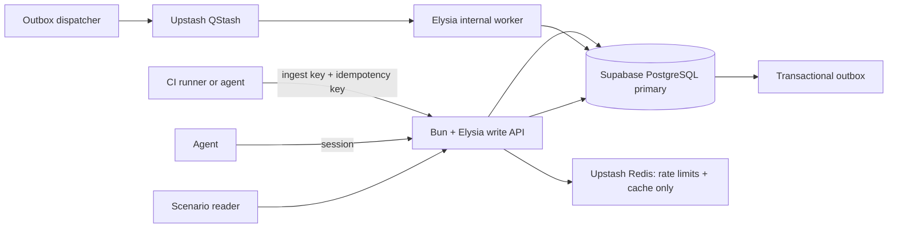

# Hosted Pilot Architecture

## Scope And Truthful Guarantees

The hosted pilot is a separate Bun/Elysia application under `hosted/`. The existing Node.js local runtime remains account-free and does not communicate with the hosted service by default.

The design targets 1,000 sustained and 5,000 peak API requests per second, with CI report ingestion and scenario reads as the first workflows. These are capacity targets to prove with production-shaped load tests, not current guarantees.

Supabase read replicas are asynchronous and read-only. All writes use one primary region, and immediate reads after a write also use that primary. Fly may run stateless API instances near clients later, but it must not claim multi-region writes while Supabase has one writable primary. Supabase PITR supports fine-grained recovery, but restoration takes the project offline and duration depends on database size; this stack does not prove RPO under one minute or RTO under five minutes until a vendor-supported configuration and repeated DR drills demonstrate both.

## Architecture

Redis is deliberately not the source of truth for reports, authorizations, idempotency, or job completion. QStash is at-least-once transport only. PostgreSQL owns durable acceptance, idempotency, outbox state, job receipts, scenario registry, report state, and audit data.

The migration enables RLS on the application tables. The hosted API uses a dedicated least-privilege `service_role` database role with explicit policies; browsers never receive that connection string. Tenant filtering remains explicit in every API query, so authorization does not rely on a future client-side `set_config` convention.

## Request Paths

### Report Intake

`POST /v1/projects/:projectId/reports` requires:

- `Authorization: Bearer <CI ingest secret>`
- `X-GhostAPI-Ingest-Key-Id: <public UUID>`
- `Idempotency-Key: <16-256 character key>`

The API hashes the canonical request. In one primary-Postgres transaction it validates the key, creates or resolves the idempotency ledger entry, writes the bounded sanitized report, and writes an outbox event. Only then does it respond with `202 Accepted`.

If the API crashes after commit but before replying, the CI runner retries with the same idempotency key and receives the original report id. If the same key has a different body, it receives `409`.

### CI Ingest Keys

Project developers provision a key with `POST /v1/projects/:projectId/ingest-keys` and an `expiresInDays` value from 1 to 90. The response returns an id, non-sensitive prefix, expiry, and a plaintext secret exactly once. Only the SHA-256 digest is written to PostgreSQL. Developers revoke a key with `POST /v1/projects/:projectId/ingest-keys/:keyId/revoke`; create and revoke actions write tenant audit events. The dashboard/client must not persist, log, or re-display the plaintext secret.

### Scenario Reads

Scenario versions are immutable. Publishing creates a new `{ scenario_key, version }` row. CI runs pin a scenario version; agents read by key/version or a selected current version. Cursor pagination and a read cache belong at the API edge only after primary-query correctness is load-tested.

Read endpoints that must observe a preceding write go to the primary and return `X-Consistency: primary`. A future replica endpoint may return `X-Consistency: eventual`; it cannot back read-your-writes behavior.

### Workers

Outbox dispatch uses `FOR UPDATE SKIP LOCKED`, leases a bounded batch, then publishes an event id to QStash. The QStash receiver verifies the request signature before parsing its body. The worker transaction creates a permanent `job_receipts` record and performs report processing atomically. Redelivery returns a duplicate success without duplicating scenario results.

The dispatcher can publish the same event more than once after an ambiguous network outcome. That is intentional: QStash deduplication has a limited window, so the permanent PostgreSQL receipt is the correctness boundary. A redelivery while an unexpired worker lease is active returns a retryable `503`; a stale lease can be safely acquired again. A completed receipt returns success without duplicating results.

## PostgreSQL Data Model

`hosted/migrations/001_core.sql` creates:

| Table                                                               | Purpose                                                   |
| ------------------------------------------------------------------- | --------------------------------------------------------- |
| `app.organizations`, `app.organization_memberships`, `app.projects` | Tenant hierarchy and membership.                          |
| `app.scenario_versions`                                             | Immutable shared scenario definitions with checksum.      |
| `app.ci_ingest_keys`                                                | Public id plus SHA-256-only CI secret digest and scope.   |
| `app.reports`                                                       | Bounded sanitized CI report payload and processing state. |
| `app.idempotency_ledger`                                            | Durable `(project_id, key)` replay contract.              |
| `app.outbox_events`                                                 | Transactional event publication source.                   |
| `app.job_receipts`, `app.scenario_run_results`                      | At-least-once worker deduplication and results.           |
| `app.audit_events`                                                  | Hosted control-plane audit metadata.                      |

Better Auth manages its own `auth` schema/tables through its migration CLI. Configure `AUTH_DATABASE_URL` with `search_path=auth`; application `DATABASE_URL` should use `search_path=app`. Keep application memberships separate from Better Auth accounts so a later SAML/OIDC identity mapping does not rewrite tenant authorization.

## Queue And Rate Limits

- Queue only identifiers and schema version, never raw report JSON, authorization headers, cookies, or provider credentials.
- Do not use a single FIFO queue. Shard flow-control keys by report/project as needed; workers make every handler idempotent.
- Verify QStash signatures on every internal job request.
- Redis keys are opaque non-secret project/principal identifiers, not bearer tokens, email addresses, or raw session ids. The default CI key budget is 300,000 requests per minute per project only as a pilot starting point; derive final limits from tenant budgets and load tests.
- Rate limits must cover unauthenticated auth routes, CI ingest key id, user/organization, project, and QStash worker endpoint separately.
- Do not enable automatic retries for non-idempotent external effects. Scenario processing remains local metadata until a typed action gateway exists.

## Capacity Plan

At 1,000 sustained writes per second, report size and retention determine cost and storage more than framework choice. Before accepting pilot load, measure actual p50/p95/p99 report bytes, write/read ratio, tenant count, retention requirements, index growth, WAL throughput, database pool waits, QStash backlog, and worker drain rate.

Initial deployment is one API write region co-located with the Supabase primary, with at least two Fly machines. Use bounded database pools per machine and Supavisor transaction pooling. Add read replicas only after primary query/index behavior is correct and clients tolerate eventual consistency.

## Required Pre-Launch Tests

1. Kill the API after Postgres commit but before response; retry must return one report id and one outbox event.
2. Force QStash redelivery and worker failure; expect one job receipt and one scenario result per report/version.
3. Soak 1,000 sustained RPS and burst 5,000 peak RPS using production p99 payloads; verify intake p95/p99, pool waits, WAL, queue depth, worker drain, and zero lost accepted report ids.
4. Verify primary read-your-writes and clearly labeled replica staleness.
5. Run a production-equivalent DR drill. Reject the stated RPO/RTO target until observed accepted-data loss is below 60 seconds and restored write availability is below 5 minutes.
6. Run authorization tests for every organization/project boundary, disabled/revoked ingest key, expired session, body/key mismatch, and direct worker invocation without a valid QStash signature.

## Identity

The hosted app mounts Better Auth for Google OAuth and email/password. Better Auth owns authentication accounts/sessions; GhostAPI owns organization membership and authorization. A later enterprise identity layer maps a verified OIDC/SAML subject to an internal user id. It must not accept arbitrary issuer, email-domain, or client-provided role claims.

## Sources Checked 2026-08-08

- Elysia validation and handler status behavior: official Elysia documentation.
- Better Auth PostgreSQL and Elysia integration: official Better Auth documentation.
- Supabase read replicas and PITR recovery limits: official Supabase documentation.
- QStash deduplication, publish, receiver verification, and at-least-once guidance: official Upstash documentation.
