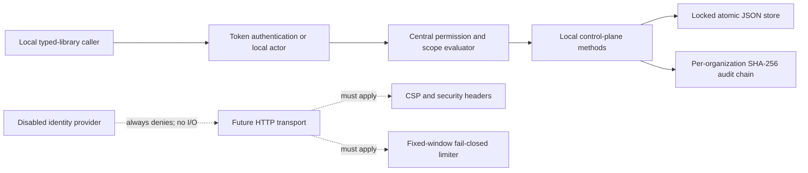

# Team Control-Plane Prototype

## Scope

As of August 8, 2026, the cloud/design-partner gate remains unmet. This is a local architecture prototype stored in a private JSON file. It has no hosted or public endpoint, network listener, deployment, SSO/OIDC/SAML integration, cloud synchronization, telemetry, or external dependency. Local GhostAPI workflows do not require an account or team token.

The store is `.ghostapi/team-control-plane.json` (or the configured `GHOSTAPI_DATA_DIR`). Existing same-directory atomic writes and cooperative cross-process locking protect updates. The store rejects symlinks and data over 1 MiB. This is not a compliance product, immutable storage system, credential broker, or distributed security boundary.

## Data Flow



No transport is supplied. A future HTTP layer must authenticate before dispatch, apply `createTeamControlPlaneSecurityHeaders()` (or the immutable `TEAM_CONTROL_PLANE_SECURITY_HEADERS`), use `TeamControlPlaneRateLimiter` before processing, avoid logging raw tokens, and fail closed on invalid keys, invalid limits, invalid clocks, or limiter capacity exhaustion.

## Tenant And Authorization Model

Organizations are tenant boundaries. Projects, environments, scenarios, evidence, policies, service accounts, tokens, and audit records all belong to one organization. Parent references are validated on every read and write. Missing scoped parents return `Resource not found`, preventing cross-tenant identifier disclosure.

All authorization uses the centralized `TEAM_PERMISSION_MATRIX`. The least-privilege matrix is:

| Role | Permissions |
| --- | --- |
| `owner` | `member.manage`, `project.manage`, `environment.manage`, `policy.manage`, `token.manage`, `service_account.manage`, `audit.read`, `audit.export`, `data.delete`, `retention.manage`, all scoped reads, `scenario.publish`, `evidence.upload` |
| `admin` | Everything listed for owner except `member.manage` |
| `developer` | Scoped reads, `scenario.publish`, `evidence.upload` |
| `viewer` | Scoped reads only |
| `service_account` | Token-scoped project/environment reads, `scenario.publish`, and `evidence.upload` only; no organization-wide policy or audit access |

`admin` cannot grant members or issue, rotate, or revoke a token for an owner. `owner` can manage every human-member token. Service-account actors have a distinct `service:<id>` audit identity and cannot impersonate a human member.

## Tokens And Service Accounts

Owners and admins create managed service accounts using an identifier and display name. A service account has no plaintext secret and is not a human member. Tokens are typed `user` or `service`, have SHA-256 digests only in persisted state, are returned once at issuance, can be revoked, and must expire within 90 days.

`issueToken` remains the human-token API. `issueServiceToken` requires a live service account and a nonempty, bounded list of scope entries. Every entry names an existing `{ projectId, environmentId }` and a nonempty subset of service-account scoped permissions. Authentication validates token digest, expiry, revocation, account state, and scope. A service actor is an in-memory authenticated capability returned only by `authenticateToken`; constructing an object with a token id is rejected. Each scoped method resolves that token's persisted scope, expiry, revocation, and account state again before acting. Rotation revokes the prior token and creates the replacement in one locked mutation; `disableServiceAccount` immediately revokes all of its live tokens. No reusable plaintext token is stored.

## Audit Integrity And Export

Schema v3 uses a per-organization append-only SHA-256 chain. Each record includes `sequence`, `previousHash`, and `recordHash`; the organization anchor supplies the sequence and hash before the retained window. `exportAudit` returns the anchor, records, and an integrity result. `verifyAuditExport` is public and detects changes to a record, record order, sequence, or chain link. Exports contain audit metadata only and never include token plaintext or other secrets.

Schema v1 migrates through v2 to v3. Legacy `member` becomes `developer`; typed user tokens replace legacy `memberId` token bindings; legacy audit rows are replayed into a validated v3 SHA-256 chain. Unknown fields, malformed references, invalid token scopes, invalid service-account references, and invalid chains fail closed.

Audit retention is bounded to 90 days and 1,000 records per organization. Pruning does not silently sever the chain: the last pruned record becomes the retained audit anchor. Sanitized evidence is retained for 30 days and capped at 100 records per organization. Owners and admins may explicitly delete evidence; deletion is tenant- and project-bound and audited. `deleteProject` removes that tenant project's environments, scenarios, evidence, and scoped service tokens in the same locked mutation. Audit export is restricted to `audit.export`; data deletion is restricted to `data.delete`.

## Identity And Incident Response

`TeamIdentityProvider` is a future integration boundary only. The single provided implementation, `createDisabledIdentityProvider`, performs no I/O and always denies authentication. No OIDC, SAML, SSO, SCIM, or remote identity protocol is implemented.

If a token is exposed, an owner or authorized admin must revoke it, remove it from local logs or CI output, rotate or issue a short-lived replacement, and inspect `exportAudit` with `verifyAuditExport`. If the integrity result is false or the store fails validation, stop using the store, preserve the file for local investigation, restore only a reviewed local backup, and do not manually repair records or bypass validation. If evidence is incorrectly retained, use explicit evidence deletion or `pruneRetention`; both actions are audited.

## Verification

```bash
npm run typecheck
npm test -- --run test/teamControl.test.ts
```

## Explicit Non-Goals

- No hosted API, public endpoint, deployment, dashboard, cloud sync, billing, SSO, SCIM, or generic project management.
- No raw traffic, source code, secrets, or automatic artifact upload.
- No compliance, legal-hold, immutable-storage, or distributed-isolation claim.
